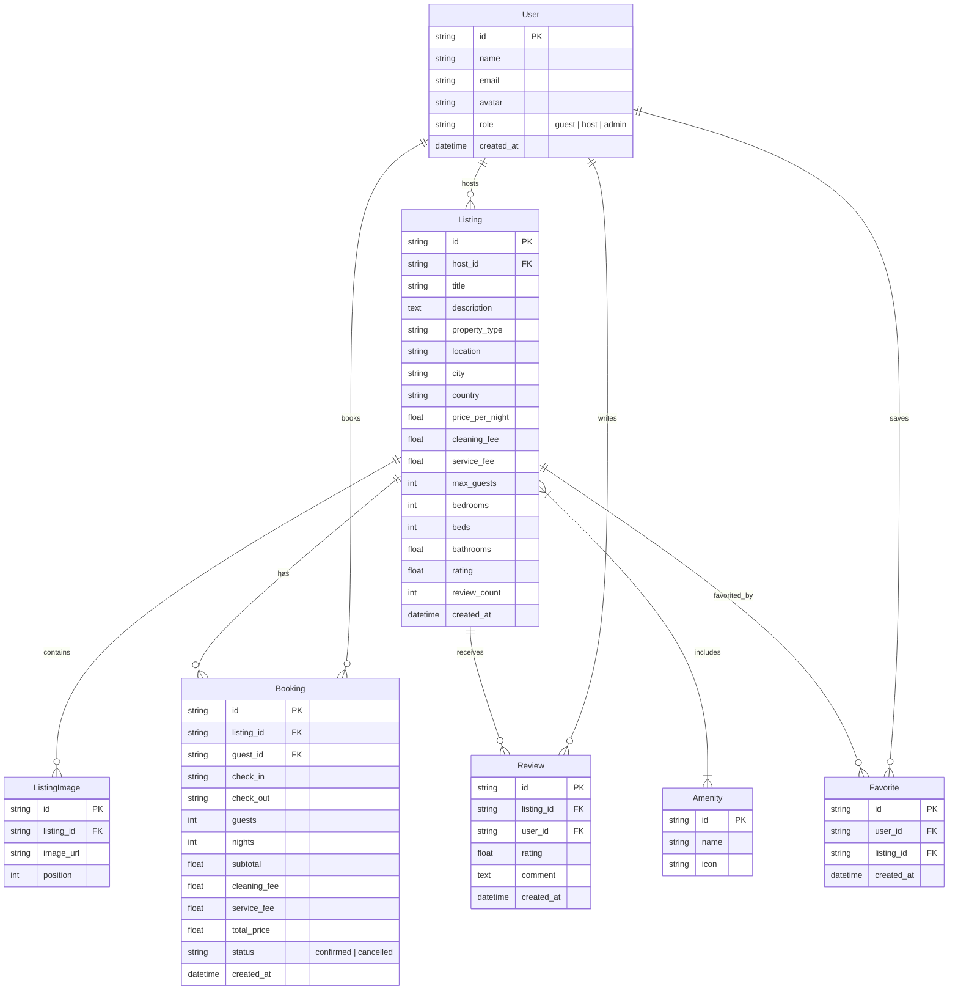

# Airbnb Web Application — SDE Fullstack Assignment

A functional full-stack clone of the **Airbnb** web application built with **Next.js (TypeScript + Tailwind CSS)**, **Python FastAPI**, and **SQLite (SQLAlchemy ORM)**. Recreates Airbnb's photo-forward UI/UX design language, core booking workflows, availability engine, search & filtering, wishlists, user trip management, and host CRUD dashboard.

---

## 🌟 Key Features

### 1. Home & Explore Page
- **Airbnb Design Language**: Authentic `#FF385C` primary brand styling, rounded cards, floating elevated elements, responsive grids.
- **Horizontal Category Bar**: Quick filtering across categories (*Beachfront, Cabins, Mansions, Amazing views, Amazing pools, Luxury, Countryside, Design, Trending, Mountains*).
- **Listing Cards**: Hover image carousels, heart bookmarking animation, location, rating score, beds/baths metadata, nightly rate formatting.

### 2. Search & Fine-Grained Filtering
- **Interactive Search Modal**: Filter by destination city/location text, date range (check-in/check-out), and guest counter (+/- adults, children).
- **Filter Modal**: Price range controls, property type selector, rooms/beds/bathrooms criteria, and amenity checkboxes (*Wifi, Pool, Air conditioning, Kitchen, Hot tub, Beach access, etc.*).
- **Backend Search Integration**: All queries executed against FastAPI endpoints with SQL filtering, sorting, and pagination.

### 3. Listing Detail Page
- **Photo Gallery**: Desktop 5-photo grid layout (1 primary hero + 4 right side images) with fullscreen lightbox viewer, and mobile responsive slider.
- **Property Breakdown**: Host avatar badge, guest capacity, bedrooms, beds, bathrooms, expandable description ("Show more").
- **Amenities Grid**: Categorized icons for property features.
- **Static Location Map**: Visual map container indicating destination area.
- **Reviews Breakdown**: Average rating scores, review cards with guest avatars, dates, comments, and form to post new reviews.

### 4. Booking Engine & Availability Validation
- **Sticky Desktop Booking Widget**: Interactive date range selector, guest dropdown, live price math (`nightly price × nights` + cleaning fee + service fee).
- **Overlapping Booking Prevention**: Backend algorithm prevents booking requested date ranges that overlap existing confirmed bookings (`existing.check_in < requested.check_out AND existing.check_out > requested.check_in`).
- **Date Validation**: Prevents past dates, check-out before check-in, and guest count exceeding max capacity.

### 5. Mock Checkout & My Trips
- **Step-by-Step Checkout**: Reservation summary, guest information, payment method selector (Credit Card / UPI), "Confirm and Pay" action.
- **Persisted Bookings**: Confirmed reservations automatically saved to SQLite and block dates on the listing calendar.
- **My Trips View (`/trips`)**: Manage active/past reservations, view status badges (`Confirmed` / `Cancelled`), and cancel bookings with a confirmation modal.

### 6. Wishlist / Favorites
- **Save Properties**: Click the heart button on any listing card or detail page to bookmark properties.
- **Wishlist View (`/wishlist`)**: Synchronized real-time with SQLite database via REST endpoints.

### 7. Host Management Dashboard (CRUD)
- **Host Overview (`/host`)**: Live statistics cards (Total listings, total bookings, estimated total revenue, occupancy rate).
- **My Listings Table**: List owned properties with view, edit (`/host/listings/[id]/edit`), and delete with confirmation modal (`"Are you sure you want to delete this listing?"`).
- **Received Bookings Table**: Monitor guest reservations made on host listings with earnings breakdown.
- **Create Listing Wizard (`/host/listings/new`)**: Multi-section form supporting property title, description, property type, location, city, country, pricing, room stats, amenity checkboxes, and Unsplash photo URLs.

### 8. Built-in Demo Role Switcher
- **Header Role Selector**: Seamlessly switch between **Demo Guest (John Doe)** and **Demo Host (Sarah Jenkins)** from the top right avatar menu to test both guest and host workflows instantly without authentication friction.

---

## 🛠️ Tech Stack

| Tier | Technology |
| :--- | :--- |
| **Frontend Framework** | Next.js 14 / 15 (App Router) |
| **Language** | TypeScript |
| **Styling** | Tailwind CSS |
| **Icons** | Lucide React |
| **Date Library** | `date-fns` |
| **Backend Framework** | Python FastAPI |
| **Database** | SQLite (`airbnb.db`) |
| **ORM** | SQLAlchemy 2.0 |
| **API Format** | REST (JSON) |
| **Schema Validation** | Pydantic v2 |

---

## 📐 Database Schema



---

## 🚀 Local Setup & Running Instructions

### 1. Prerequisites
- Python 3.10+
- Node.js 18+ & npm

### 2. Backend Setup (FastAPI + SQLite)

```bash
# Navigate to backend directory
cd backend

# Create Python virtual environment
python -m venv venv

# Activate virtual environment
# On Windows PowerShell:
.\venv\Scripts\Activate.ps1
# On Linux/macOS:
source venv/bin/activate

# Install backend dependencies
pip install -r requirements.txt

# Run database seed script (Populates 18+ listings, users, reviews, bookings)
python -m app.seed

# Start FastAPI development server
uvicorn app.main:app --host 127.0.0.1 --port 8000 --reload
```
The FastAPI backend server will run on `http://127.0.0.1:8000`. You can inspect interactive API documentation at `http://127.0.0.1:8000/docs`.

### 3. Frontend Setup (Next.js)

```bash
# Open a new terminal and navigate to frontend directory
cd frontend

# Install npm dependencies
npm install

# Start Next.js development server
npm run dev
```
The Next.js frontend application will run on `http://localhost:3000`.

---

## 🔌 API Endpoints Summary

| Category | Method | Endpoint | Description |
| :--- | :--- | :--- | :--- |
| **Listings** | `GET` | `/api/listings` | Fetch listings with search, category, price, capacity filters |
| **Listings** | `GET` | `/api/listings/{id}` | Get detailed listing information by ID |
| **Listings** | `POST` | `/api/listings` | Create a new property listing (Host) |
| **Listings** | `PUT` | `/api/listings/{id}` | Update existing property listing (Host) |
| **Listings** | `DELETE` | `/api/listings/{id}` | Delete listing by ID (Host) |
| **Availability** | `GET` | `/api/listings/{id}/availability` | Get confirmed booked date ranges for calendar blocking |
| **Bookings** | `POST` | `/api/bookings` | Create reservation with overlap & date validation |
| **Bookings** | `GET` | `/api/bookings` | List user reservations or host listing bookings |
| **Bookings** | `DELETE` | `/api/bookings/{id}` | Cancel reservation by ID |
| **Reviews** | `GET` | `/api/listings/{id}/reviews` | Fetch reviews for listing |
| **Reviews** | `POST` | `/api/listings/{id}/reviews` | Post a new review and recalculate average rating |
| **Favorites** | `GET` | `/api/favorites` | Fetch user wishlist items |
| **Favorites** | `POST` | `/api/favorites/{listing_id}` | Add listing to user wishlist |
| **Favorites** | `DELETE` | `/api/favorites/{listing_id}` | Remove listing from wishlist |
| **Host** | `GET` | `/api/host/listings` | Get listings owned by host |
| **Host** | `GET` | `/api/host/bookings` | Get bookings received by host |
| **Host** | `GET` | `/api/host/stats` | Get host performance overview & revenue metrics |

---

## 👤 Demo Accounts & Roles

| Role | User Name | Email | User ID |
| :--- | :--- | :--- | :--- |
| **Demo Guest** | Ranjot | `ranjot@example.com` | `usr_guest_1` |
| **Demo Host** | Ria | `ria@example.com` | `usr_host_1` |

Use the role switcher in the top right user menu to toggle between Guest and Host mode.

---

## 💡 Assumptions & Design Choices
- **Mocked Authentication**: Uses a client-side session context (`AuthContext`) with predefined guest/host roles as permitted by assignment guidelines.
- **Mocked Checkout**: Payment flow collects guest details and simulates successful credit card/UPI processing without external payment gateways.
- **High-Resolution Images**: Listing photos use curated Unsplash real estate & vacation home CDN URLs.
- **Idempotent Seeding**: Seed script checks table existence so running `seed.py` multiple times does not produce duplicate entries.
